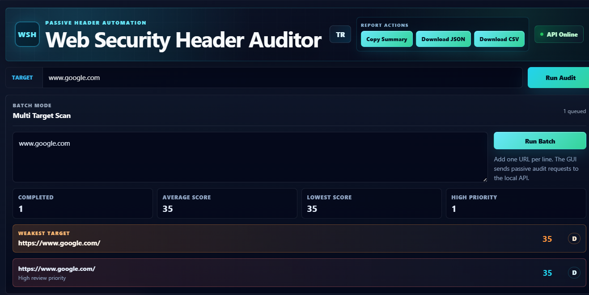
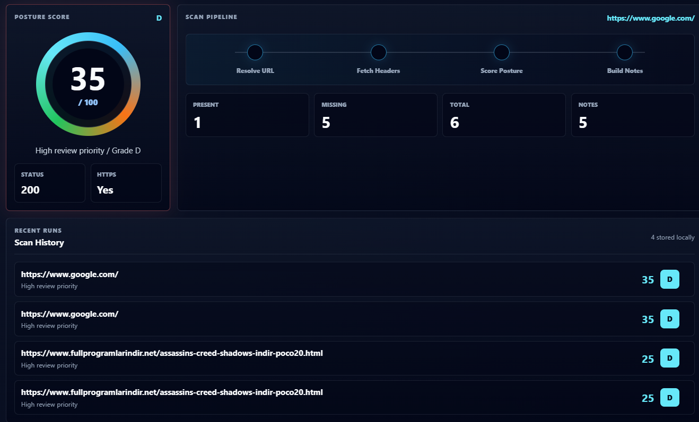
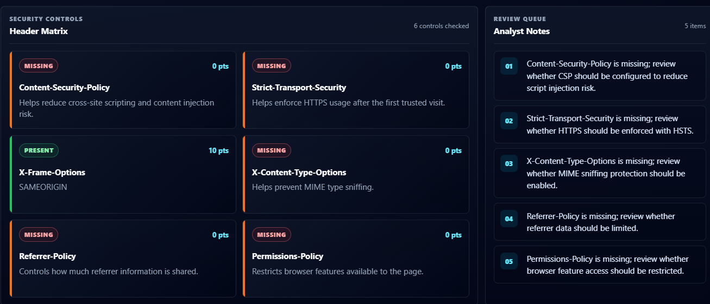

# Web Security Header Auditor

Passive security review tool for auditing HTTP security headers, cookie flags, score posture, and remediation notes.

This project started as a CLI-based auditor and now includes:

- Python CLI
- FastAPI audit API
- React + TypeScript GUI
- Single URL scan
- Batch URL scan
- JSON and CSV export
- Scan history
- TR/EN interface support
- Passive, non-invasive security review workflow

> Safety note: This tool only reviews HTTP response data. It does not exploit, fuzz, brute force, bypass authentication, or send attack payloads.

---

## GUI Preview

### Batch Scan and Report Actions

The GUI supports target input, batch scanning, report actions, language switching, and API status display.



### Score, Pipeline, and Scan History

Each audit result includes score, grade, HTTPS usage, status code, pipeline view, and local scan history.



### Header Matrix and Analyst Notes

The header matrix shows present and missing controls. Analyst notes explain which headers should be reviewed.



---

## Features

### CLI

- Audit a single URL
- Audit multiple URLs from a file
- Generate text reports
- Generate JSON reports
- Generate CSV reports
- Use fail-below thresholds for CI-style checks

### API

- FastAPI backend
- `/health` endpoint
- `/audit` endpoint
- OpenAPI documentation at `/docs`

### GUI

- Single target scan
- Multi-target batch scan
- Score and grade display
- Risk-colored severity visuals
- Header matrix
- Analyst review notes
- Scan history
- Weakest target highlight
- Copy summary action
- Download JSON action
- Download CSV action
- English and Turkish UI mode

---

## Security Headers Checked

| Header | Purpose |
| --- | --- |
| `Content-Security-Policy` | Helps reduce cross-site scripting and content injection risk. |
| `Strict-Transport-Security` | Helps enforce HTTPS after the first trusted visit. |
| `X-Frame-Options` | Helps reduce clickjacking risk. |
| `X-Content-Type-Options` | Helps prevent MIME type sniffing. |
| `Referrer-Policy` | Controls how much referrer information is shared. |
| `Permissions-Policy` | Restricts browser features available to the page. |

---

## Project Structure

```text
.
├── frontend/
│   ├── src/
│   │   ├── App.tsx
│   │   ├── App.css
│   │   ├── i18n.ts
│   │   └── main.tsx
│   └── package.json
├── src/
│   ├── web_security_header_auditor.py
│   └── web_security_header_auditor_api.py
├── sample-inputs/
│   └── urls.txt
├── docs/
│   └── screenshots/
│       ├── gui-batch-overview.png
│       ├── gui-score-history.png
│       └── gui-header-matrix.png
├── requirements.txt
└── README.md
```

---

## Installation

Install Python dependencies:

```powershell
python -m pip install -r .\requirements.txt
```

Install frontend dependencies:

```powershell
npm --prefix .\frontend install
```

---

## CLI Usage

Run a single audit:

```powershell
python .\src\web_security_header_auditor.py --url https://example.com
```

Run a batch audit:

```powershell
python .\src\web_security_header_auditor.py --urls-file .\sample-inputs\urls.txt
```

Write JSON output:

```powershell
python .\src\web_security_header_auditor.py --url https://example.com --json-out .\reports\example.json
```

Write CSV output:

```powershell
python .\src\web_security_header_auditor.py --url https://example.com --csv-out .\reports\example.csv
```

Use a score threshold:

```powershell
python .\src\web_security_header_auditor.py --url https://example.com --fail-below 80
```

---

## API Usage

Start the API:

```powershell
$env:PYTHONPATH = ".\src"
python -m uvicorn web_security_header_auditor_api:app --reload
```

Health check:

```powershell
Invoke-RestMethod -Method Get -Uri http://127.0.0.1:8000/health
```

Run an audit:

```powershell
Invoke-RestMethod `
  -Method Post `
  -Uri http://127.0.0.1:8000/audit `
  -ContentType "application/json" `
  -Body '{"url":"https://example.com"}'
```

Open API docs:

```text
http://127.0.0.1:8000/docs
```

---

## GUI Usage

Start the API in one terminal:

```powershell
$env:PYTHONPATH = ".\src"
python -m uvicorn web_security_header_auditor_api:app --reload
```

Start the frontend in another terminal:

```powershell
npm --prefix .\frontend run dev
```

Open:

```text
http://localhost:5173/
```

---

## Report Outputs

| Output | Usage |
| --- | --- |
| Text | Human-readable terminal report |
| JSON | Structured automation-friendly report |
| CSV | Spreadsheet-friendly summary report |
| GUI Copy Summary | Quick analyst summary copied to clipboard |

---

## Scoring

The score is a review priority indicator, not a vulnerability verdict.

| Score Range | Meaning |
| --- | --- |
| `80-100` | Strong header posture |
| `50-79` | Needs review |
| `0-49` | High review priority |

---

## Validation

Compile Python files:

```powershell
python -m py_compile .\src\web_security_header_auditor.py
python -m py_compile .\src\web_security_header_auditor_api.py
```

Build frontend:

```powershell
npm --prefix .\frontend run build
```

Check API paths:

```powershell
python -c "import sys; sys.path.insert(0, 'src'); from web_security_header_auditor_api import app; print(app.openapi()['paths'].keys())"
```

---

## Defensive Use Only

This project is intended for passive security review, learning, and defensive validation workflows.
